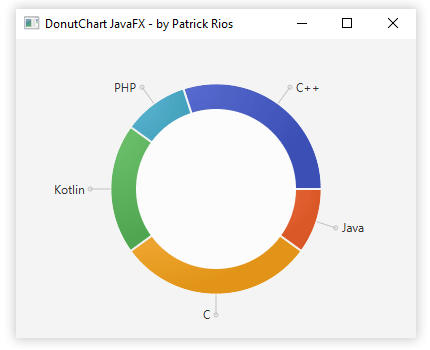
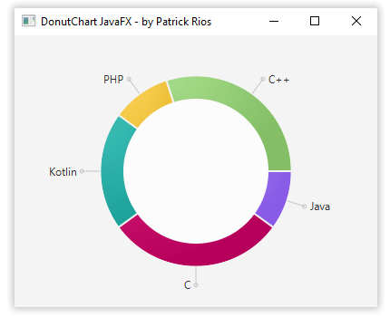

# DonutChart JavaFX
A custom pie chart to looks like a donut chart

[how use it](##how-use-it?)

[styling](##styling)



## How use it?
* Preparing datas
```java
ArrayList<PieChart.Data> datas = new ArrayList<>();
datas.add(new Data("Java",10));
datas.add(new Data("C", 30));
datas.add(new Data("Kotlin", 20));
datas.add(new Data("PHP", 10));
datas.add(new Data("C++", 30));
```

* Instance
```java
DonutChart donut = new DonutChart(FXCollections.observableList(datas));
```

* Add to container
```java
AnchorPane anchor = new AnchorPane();
anchor.getChildren().add(donut);
```
## Styling
* center radius circle value and color
```java
donut.setCenterCircleStyle(80.0f,"#FCFCFC");
```

* pies color
```java
donut.pieColors("#9966FF","#CC0066","#20B2AA","#FFCC33","#93D573");
```
